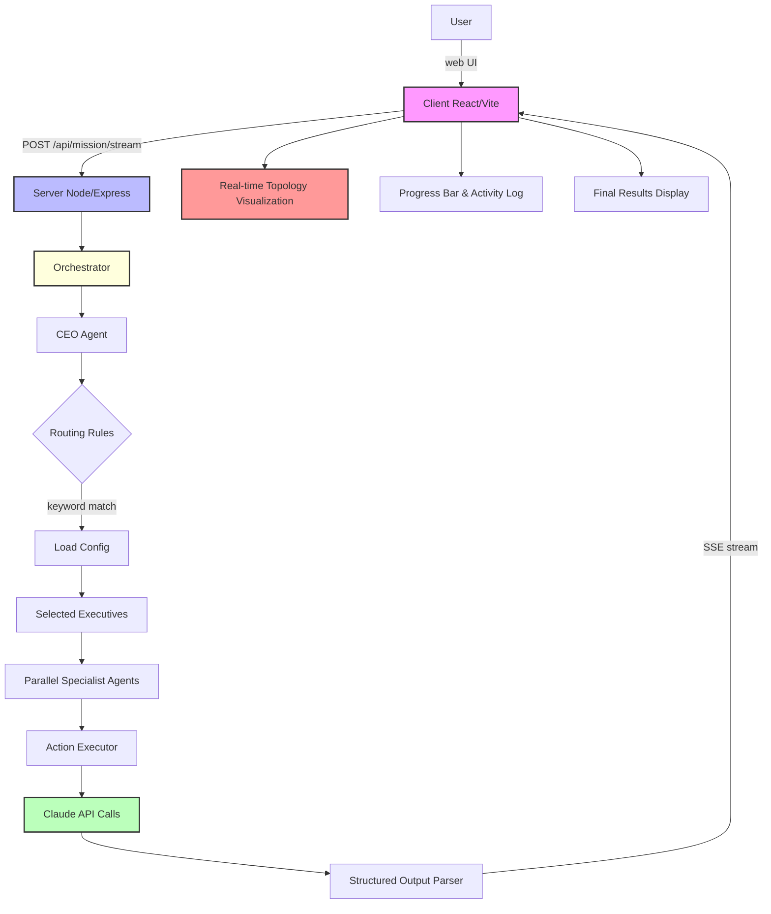

# Jarvis Portal (React + Node + Anthropic)

## Project Description

Jarvis is an **AI-powered organizational assistant** that simulates a realistic corporate hierarchy to handle complex business missions. It orchestrates multiple Claude AI agents across different departments and specialist roles, enabling collaborative problem-solving at scale.

**Key Capabilities:**
- Submit business missions through an intuitive React portal
- Intelligently route missions to relevant executives and specialists using keyword matching
- Execute hierarchical multi-agent conversations (CEO → Executives → Specialists)
- Stream real-time progress updates showing which agents are working
- Visualize the entire organizational topology during execution
- Maintain session memory across multiple missions for continuity
- Support voice input via Web Speech API for hands-free mission submission

Jarvis is now a full-stack portal with:
- **React + Vite** frontend for mission submission, real-time visualization, and result viewing
- **Node/Express** backend for hierarchical AI orchestration with server-sent events streaming
- **Anthropic Claude API** for intelligent CEO → C-suite → specialist decision-making flow
- **Structured output** parsing to extract executive decisions and specialist outputs
- Full organizational structure with Finance, Engineering, Operations, and Marketing branches

## Architecture

### High-Level Data Flow

```
User Mission
    ↓
React UI (voice or text input)
    ↓
POST /api/mission/stream (with SessionID)
    ↓
Orchestrator (picks routing rules)
    ↓
CEO Agent (understands mission & directs team)
    ↓
Selected Executives (CTO/COO/CMO/CFO)
    ↓
Specialists (parallel execution: Engineering, Data, Sales, etc.)
    ↓
CEO Final Synthesis (consolidates all inputs)
    ↓
Structured Output (extract actions & summary)
    ↓
Server-Sent Events (stream updates back to frontend)
    ↓
React UI (visualize results in real-time)
```

### Organizational Hierarchy

**CEO Level:**
- **Alex Prime** (CEO) - Reviews mission, routes to executives, provides final synthesis

**Executive Level (C-Suite):**
- **Nova Circuit** (CTO) - Technology decisions → subordinates: Engineering, Data
- **Sage Ops** (COO) - Operations decisions → subordinates: Sales
- **Luna Reach** (CMO) - Marketing decisions → subordinates: Content, Growth
- **Mira Ledger** (CFO) - Finance decisions → subordinates: FP&A, Accounting, Treasury

**Specialist Level (Individual Contributors):**
- Engineering (Volt Build), Data (Iris Analytics)
- Sales (Rex Pipeline)
- Content (Pixel Story), Growth (Flux Growth)
- FP&A (Atlas Forecast), Accounting (Tally Books), Treasury (Vault Cash)

### System Architecture Diagram



### Request/Response Flow

**Frontend Request:**
```json
{
  "mission": "Launch a new device protection plan with engineering, growth, and finance support.",
  "memory": "Previous context from last mission...",
  "sessionId": "session-1717225200000"
}
```

**Backend Streaming Response (Server-Sent Events):**
```
data: {"type": "mission_started", "timestamp": "..."}

data: {"type": "routing_completed", "executives": ["cto", "cmo", "cfo"]}

data: {"type": "ceo_initial_completed", "message": "I'll coordinate..."}

data: {"type": "executive_started", "executiveId": "cto", "executiveName": "Nova Circuit"}

data: {"type": "specialist_started", "executiveId": "cto", "specialistId": "engineering", ...}

data: {"type": "specialist_completed", "specialistId": "engineering", "output": "..."}

data: {"type": "executive_completed", "executiveId": "cto", "output": "..."}

data: {"type": "mission_completed", "result": {...}}
```

## Project Structure

```
jarvis/
├── client/                          # React + Vite Frontend Portal
│   ├── index.html                   # HTML entry point
│   ├── package.json                 # Client dependencies
│   ├── vite.config.js               # Vite build configuration
│   └── src/
│       ├── main.jsx                 # React app bootstrap
│       ├── App.jsx                  # Main component (mission UI, results display)
│       └── styles.css               # Portal styling
│
├── server/                          # Node.js/Express Backend API
│   ├── package.json                 # Server dependencies
│   └── src/
│       ├── index.js                 # Express server & route handlers
│       ├── config.js                # Config loader (agents.json, routing-rules.json)
│       ├── orchestrator.js          # Mission routing & agent orchestration logic
│       ├── anthropicClient.js       # Claude API wrapper & agent execution
│       ├── actionExecutor.js        # Executes parsed actions from AI responses
│       └── structuredOutput.js      # Parses & extracts structured data from AI output
│
├── config/
│   ├── agents.json                  # Organization chart (CEO, C-suite, specialists)
│   │                                 # Defines hierarchy, names, and prompt files
│   └── routing-rules.json           # Keyword-based routing rules for mission dispatch
│                                     # Maps mission keywords to executives/specialists
│
├── prompts/                         # System prompts for all agents
│   ├── ceo.md                       # CEO role definition & instructions
│   ├── executives/
│   │   ├── cto.md                   # CTO role & responsibilities
│   │   ├── coo.md                   # COO role & responsibilities
│   │   ├── cmo.md                   # CMO role & responsibilities
│   │   └── cfo.md                   # CFO role & responsibilities
│   └── specialists/
│       ├── engineering.md           # Engineering specialist prompt
│       ├── data.md                  # Data specialist prompt
│       ├── sales.md                 # Sales specialist prompt
│       ├── content.md               # Content specialist prompt
│       ├── growth.md                # Growth specialist prompt
│       ├── fpa.md                   # FP&A specialist prompt
│       ├── accounting.md            # Accounting specialist prompt
│       └── treasury.md              # Treasury specialist prompt
│
├── workflows/                       # (Optional) Workflow definitions
├── Jarvis.json                      # n8n workflow config (for voice/webhook integration)
├── voice_trigger.html               # Voice input interface (alt to web UI)
├── .env.example                     # Environment variables template
├── .gitignore
├── README.md                        # This file
└── package.json                     # Root workspace configuration

```

### Key Configuration Files

**config/agents.json:**
- Defines the complete organizational structure
- Maps agent IDs to their names, titles, and prompt files
- Specifies executive-to-specialist relationships
- Used by orchestrator to construct the hierarchy

**config/routing-rules.json:**
- Keyword-based routing rules that match missions to executives
- Example: If mission contains "engineering", route to CTO
- Fallback behavior: if no keywords match, route to all executives (ensures comprehensive response)

**prompts/:\*md:**
- System prompts that define each agent's personality, role, and behavior
- Loaded dynamically by orchestrator
- Used as context when calling Claude API

## Session Management

### What is a Session?

A **session** represents a single mission execution lifecycle. Each time a user submits a mission, a new session is created with a unique ID (`session-{timestamp}`). Sessions persist throughout the conversation, allowing users to view history, switch between missions, and maintain context.

### Session Object Structure

```javascript
{
  id: "session-1717225200000",           // Unique session identifier
  mission: "Launch a new device...",      // Original mission text
  status: "running|done|failed|cancelled",// Current execution state
  createdAt: "2026-06-01T10:00:00Z",     // Session creation timestamp
  
  // Real-time execution tracking
  kickoffMessage: "Alright team...",      // CEO's opening message
  activeAgents: {                         // Which agents are currently working
    ceo: true,
    cto: false,
    engineering: true,
    ...
  },
  
  // Progress visualization
  progressTotal: 10,                      // Estimated total execution steps
  progressDone: 3,                        // Steps completed
  progressPercent: 30,                    // Percentage complete
  activities: [                           // Recent activity log (last 5)
    "CEO is understanding the mission...",
    "CEO selected the right team",
    "CTO is planning..."
  ],
  currentActivity: "Engineering is working...",
  
  // Raw event stream
  progressEvents: [                       // All streaming events received
    { type: "mission_started", timestamp: "..." },
    { type: "routing_completed", executives: [...] },
    { type: "specialist_completed", specialistId: "engineering", output: "..." },
    ...
  ],
  
  // Live agent data during execution
  liveExecutives: {
    "cto": {
      id: "cto",
      name: "Nova Circuit",
      title: "CTO",
      output: "Executive summary...",
      specialists: [
        { id: "engineering", name: "Volt Build", output: "...", status: "done" },
        { id: "data", name: "Iris Analytics", output: "...", status: "done" }
      ]
    },
    ...
  },
  
  // Final results
  result: {                               // Populated when status === "done"
    final: "CEO's final synthesized response...",
    executives: [
      { id: "cto", name: "Nova Circuit", title: "CTO", output: "...", specialists: [...] },
      ...
    ]
  }
}
```

### Session Lifecycle

```
1. USER SUBMITS MISSION
   ↓
   Session created with status="running"
   Display empty topology, progress=0%
   ↓
2. STREAMING BEGINS
   Each server event updates session state:
   
   - mission_started: Acknowledge receipt
   - routing_completed: Determine which executives selected, calculate progressTotal
   - ceo_initial_started/completed: CEO analyzes mission
   - executive_started: Executive begins planning
   - specialist_started/completed: Individual specialists work in parallel
   - ceo_final_started: CEO consolidates all inputs
   - mission_completed: Final result populated, status="done"
   ↓
3. REAL-TIME UI UPDATES
   - Active agents highlight in topology
   - Progress bar advances
   - Activity carousel rotates
   - Live executive/specialist outputs appear
   ↓
4. SESSION ENDS
   - Final CEO response displayed
   - All executive & specialist outputs shown
   - Session moved to history
   - User can create new mission or switch to previous sessions
```

### Multi-Session Features

**Session History:**
- All sessions stored in React component state (`sessions` array)
- Displayed in sidebar as "Conversation Thread"
- Each entry shows:
  - Status indicator (dot: running, done, failed, cancelled)
  - Mission text (truncated)
  - Click to switch to that session

**Context Memory:**
- When submitting a new mission, the previous session's final CEO response is included
- Passed as `memory` parameter in `/api/mission` request
- Limited to first 5000 characters to keep context manageable
- Enables agents to reference previous decisions & outputs

**Session Switching:**
- Users can click a previous mission to view its results
- Mission input text auto-fills with that mission's text
- All results (CEO response, executive outputs, progress) reload
- Active session indicator shows which session is currently displayed

### Frontend Session Management

**State Variables:**
```javascript
const [sessions, setSessions] = useState([])        // Array of all sessions
const [activeSessionId, setActiveSessionId] = useState(null) // Currently displayed session
const [loading, setLoading] = useState(false)       // Is a mission running?
const [error, setError] = useState("")              // Error message if any
const activeSession = useMemo(
  () => sessions.find(s => s.id === activeSessionId),
  [sessions, activeSessionId]
)
```

**Session Update Strategy:**
- When streaming events arrive, orchestrator calls `updateSession(updater)`
- `updater` function receives current session and returns updated version
- Immutable state update pattern ensures React re-renders efficiently
- Real-time visualization responds immediately to each event

**Cancellation:**
- Users can cancel a running mission at any time
- Frontend calls `POST /api/mission/cancel` with `sessionId`
- Aborts the fetch stream (`streamAbortRef.current.abort()`)
- Session status changes to "cancelled"

### Backend Session Tracking

**Session Lifecycle (Server):**
1. Receive `/api/mission` request with `sessionId`
2. Load previous context from `memory` parameter (if provided)
3. Start orchestration loop
4. Stream progress events back with `sessionId` in payload
5. On completion or error, close the SSE stream

**Session Isolation:**
- Each session executes independently
- No shared state between concurrent missions
- SessionId included in all streaming events for proper frontend matching
- Allows true concurrent multi-session support if frontend initiates parallel requests

### Example: Full Session Execution Timeline

```
t=0ms     Session created: "session-1717225200000"
t=50ms    Message: mission_started
t=100ms   Message: routing_completed (executives: [cto, cmo, cfo])
t=150ms   Message: ceo_initial_started
t=450ms   Message: ceo_initial_completed
t=500ms   Message: executive_started (CTO)
t=550ms   Message: specialist_started (Engineering under CTO)
t=750ms   Message: specialist_completed (Engineering output)
t=800ms   Message: specialist_started (Data under CTO)
t=950ms   Message: specialist_completed (Data output)
t=1000ms  Message: executive_completed (CTO output)
t=1050ms  Message: executive_started (CMO)
...
t=3000ms  Message: executive_completed (CMO output)
t=3050ms  Message: ceo_final_started
t=5000ms  Message: mission_completed (result with all outputs)

Session Status Changes:
- t=0ms: status = "running"
- t=5000ms: status = "done"

Progress Visualization:
- t=0-100ms: 0% (starting)
- t=100ms: 0% (total units calculated = 9)
- t=450ms: 11% (ceo initial done)
- t=1000ms: 33% (cto executive + 2 specialists done)
- t=3000ms: 55% (more executives done)
- t=5000ms: 100% (mission complete)

UI Display:
- Kickoff message types character-by-character
- Topology nodes light up as agents become active
- Activity carousel rotates through recent activities
- Final response section fills in incrementally
- Executive details populate as they complete
```

- Node.js 18+
- Anthropic API key

## Setup

1. Copy `.env.example` to `.env`
2. Fill `ANTHROPIC_API_KEY`
3. Install dependencies:

```bash
npm install
```

4. Run frontend + backend:

```bash
npm run dev
```

5. Open `http://localhost:5174` (faculty portal uses `5173`)

Backend runs on `http://localhost:4000`.

## API Endpoints

### GET `/api/health`
Returns server health status.
```json
{ "status": "ok" }
```

### GET `/api/org`
Returns the complete organization configuration (agents.json).
Used by frontend to render topology and understand hierarchy.
```json
{
  "organization": "Jarvis",
  "provider": "anthropic",
  "ceo": { ... },
  "executives": [ ... ],
  "specialists": [ ... ]
}
```

### POST `/api/mission/stream` ⭐ Main Endpoint
Submits a mission and streams real-time progress updates via Server-Sent Events (SSE).

**Request Body:**
```json
{
  "mission": "Launch a new device protection plan with engineering, growth, and finance support.",
  "memory": "Previous mission context (optional, first 5000 chars)",
  "sessionId": "session-1717225200000"
}
```

**Response:** Server-Sent Events stream with JSON payloads:
```
data: {"type": "mission_started", "timestamp": "..."}
data: {"type": "routing_completed", "executives": ["cto", "cmo", "cfo"]}
data: {"type": "ceo_initial_started"}
data: {"type": "ceo_initial_completed", "message": "..."}
data: {"type": "executive_started", "executiveId": "cto", "executiveName": "Nova Circuit"}
data: {"type": "specialist_started", "executiveId": "cto", "specialistId": "engineering", ...}
data: {"type": "specialist_completed", "specialistId": "engineering", "specialistName": "Volt Build", "output": "..."}
data: {"type": "executive_completed", "executiveId": "cto", "executiveName": "Nova Circuit", "output": "..."}
data: {"type": "ceo_final_started"}
data: {"type": "mission_completed", "result": {"final": "...", "executives": [...]}}
```

**Event Types:**
- `mission_started` - Mission received and processing begins
- `routing_completed` - Routing rules applied, executives selected
- `ceo_initial_started/completed` - CEO understands mission & provides direction
- `executive_started/completed` - Executive plans their branch
- `specialist_started/completed` - Specialist executes their role
- `ceo_final_started/completed` - CEO synthesizes all inputs
- `mission_completed` - Full result ready
- `mission_failed` - Error during execution
- `mission_cancelled` - User cancelled the mission

### POST `/api/mission/cancel`
Cancels an active mission execution.

**Request Body:**
```json
{
  "sessionId": "session-1717225200000"
}
```

**Response:**
```json
{ "status": "cancelled" }
```

## How It Works

### Mission Routing
1. **User submits a mission** via React UI (text or voice input)
2. **Orchestrator analyzes** the mission text using routing rules from `config/routing-rules.json`
3. **Keyword matching** determines which executives should be involved
4. **Smart fallback**: If no keywords match or mission is broad (contains "build", "launch", "plan" + "company/product"), all executives are engaged
5. **Streaming begins** with routing results immediately sent to frontend

### Agent Orchestration
1. **CEO Initial** - Claude receives mission + CEO prompt, understands requirements, creates initial direction
2. **Executive Level** - Selected executives (CTO/COO/CMO/CFO) receive:
   - Original mission
   - CEO's direction
   - List of their subordinates
   - Their role prompt
3. **Specialist Level** - Each specialist receives:
   - Mission context
   - Their executive's guidance
   - Their specialist prompt
   - Can execute in parallel (no ordering dependency)
4. **CEO Final** - CEO receives all executive outputs, synthesizes into comprehensive final response

### Parallel Execution
- Specialists under the same executive run concurrently
- Different executive branches also run concurrently
- Frontend displays all active agents in real-time on the topology visualization
- Progress bar estimated based on routing results (not actual timing)

### Output Parsing
- Claude responses are wrapped with `STRUCTURED_RESPONSE_INSTRUCTION` format
- Responses typically contain:
  - **Summary** of decisions/recommendations
  - **Actions** (if applicable)
  - **Next Steps** or implementation details
- Structured output parser extracts these sections for clean presentation

### Memory & Context
- Previous mission's final response included in next mission's "memory" parameter
- Agents use this context for continuity and referenced decisions
- Capped at 5000 characters to maintain token efficiency
- Enables multi-turn conversations within a session thread

## Technical Highlights

**Frontend:**
- React 19.2 with hooks for state management
- Vite for fast development & builds
- Web Speech API for voice input
- Server-Sent Events (SSE) for real-time streaming
- No external UI libraries (pure React + CSS)

**Backend:**
- Express.js server with middleware
- Streaming responses with custom SSE format
- Concurrent mission execution support
- Graceful error handling & cancellation

**AI Integration:**
- Anthropic Claude 3.5 Sonnet model
- System prompts for each organizational role
- Structured output extraction with regex parsing
- Token-efficient memory management

**State Management:**
- Frontend maintains immutable session state
- Real-time updates via streaming events
- Session history persists in component state during browsing
- Backend session isolation for concurrent requests

## Notes

- **Routing** is keyword-based via `config/routing-rules.json`
- **Fallback behavior**: If no keyword matches, all executives are engaged (ensures comprehensive response)
- **Model**: Claude 3.5 Sonnet (`claude-3-5-sonnet-20241022`)
- **Streaming**: All responses streamed via SSE for real-time UI updates
- **Session memory**: Previous mission results automatically included for context continuity
- **Voice support**: Uses native Web Speech API (Chrome, Edge, Safari compatible)
- **Concurrency**: Multiple missions can execute simultaneously without interference
- **Cancellation**: Missions can be aborted mid-execution via `/api/mission/cancel` endpoint
